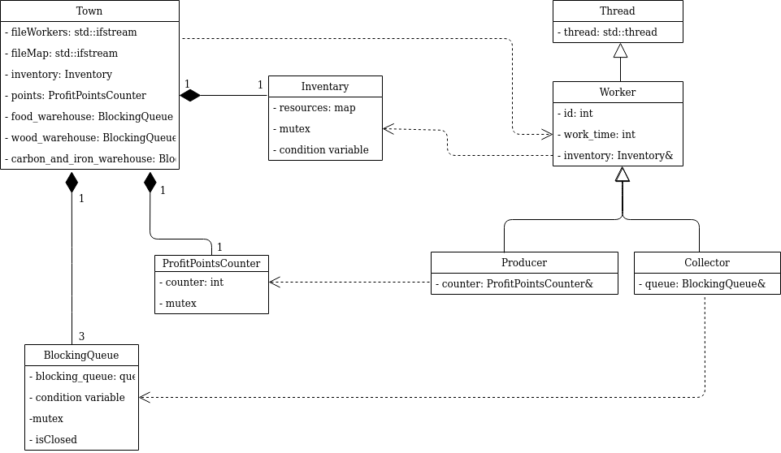

# Informe del Trabajo Práctico 2
### Alumno: Francisco Ruiz. Padrón:99429
### Link: https://github.com/FRuiz811/tp2.git

En el siguiente informe se presentará un resumén de como se encaró la 
resolución del problema planteado en el trabajo práctico. Se adjuntarán 
diagramas descriptivos que intentarán ayudar a la explicación del mismo.
Por último, detallaré algunos inconvenientes a los cuales me enfrente y cómo 
resolví la cuestión.

## Descripción de la Resolución
El siguiente diagrama nos presenta un pantallazo general de como está 
conformada la resolución para el trabajo práctico, en esta imagen se evitó 
poner cada una de las clases de los trabajadores específicos para que quede 
más claro, dado que agregar esas clases acá no traía una información 
sustancial:

Si bien no están todos los detalles a nivel implementación, permite observar 
como se realizó el manejo de la herencia en los trabajadores para terminar 
realizando una clase particular para cada uno de ellos. De esto hablaré más 
adelante.

El diseño del problema planteado se intentó implementar en 2 partes (casi) 
separadas, donde el inventario hacía las veces de nexo entre las mismas. Pero 
primero comentaré algunos detalles de diseño:

La clase Town, es el orquestador del "juego", se encarga de lanzar todos sus 
trabajadores, procesar los recursos en el mapa, realizar el join de los 
diferentes workers y mostrar los resultados en pantalla. Se lo pensó de esta 
manera porque en caso de que se necesite tener trabajadores para distintos 
pueblos, de esta manera es posible y se podría realizar una competencia para 
ver que Town genera más puntos de beneficios. Esta es la razón por la cual se 
prefirió abstraer al orquestador en una clase.

Los recursos no fueron implementados como una clase debido a que no le 
encontré ningún tipo de ventaja a eso. No tienen una funcionalidad específica 
y no creo que la tengan incluso si el juego creciera. Me pareció que lo mejor 
era dejarlos tal como se los lee desde el mapa.

Con respecto a la implementación, se realizaron las colas bloqueantes, los 
recolectores y la parte del inventario encargada de recibir los recursos 
procesados por estos trabajadores por un lado, y por el otro se hizo el 
contador de puntos de beneficios, los productores y la parte del inventario de 
la cual se retiraban los recursos para generar estos puntos.

Los recolectores iran sacando de a uno los recursos que fueron cargados en la 
cola bloqueante con la cual deben trabajar según el tipo de recolector que 
sean. Esta quita de recursos de la cola, se realizará de manera controlada, 
cada vez que algún trabajador quiera retirar un recurso, deberá adquirir un 
lock y en caso de que esté vacía aguardarán a ser notificados de que hay una n
nueva unidad almacenada.  A medida que los retiran, trabajaran con ellos y 
luego los depositarán en el inventario. El manejo del inventario, lo hablaré más adelante.

Los productores son los encargados de generar los puntos de beneficios para el 
Town en el cual trabajan. Estos los generan trabajando los recursos que 
obtienen del inventario, siempre y cuando estén disponibles en las cantidades 
necesarias. Luego de trabajarlos, los productores deberán adquirir el lock del 
contador que tienen asignado. La clase ProfitPointsCounter es un monitor que 
controla el acceso al contador de puntos para que cada vez que se intente 
sumar puntos realmente se haga y no se pierdan puntos por un mal acceso al 
mismo.

## Problemas Encontrados

### Especificación de los Workers

Si bien los Workers podrían ser simplemente Collector o Producer sin más 
especificación, decidí implementar cada una de las clases para cada
trabajador. Me pareció que en algún momento cada Worker, podría tener 
funcionalidades distintas a las otras o que podrían avanzar su nivel de manera 
independiente del resto. 

En el caso de los Producer, me pareció más prolijo para especificar los puntos 
que generan y los recursos que necesitan para ello. En caso de los Collector, 
es donde menos sentido le veo a la especificación, pero al realizarlo en los
productores me pareció correcto también aplicarla en los recolectores.

### Manejo del Inventario

El inventario fue la parte que me trajo mayores problemas, en particular la 
parte de retirar los recursos por parte de los productores. 

El inventario comienza sin estar inicializado, al momento de crearse algún 
recolector de cualquier tipo, se le indica que para los recursos que trabaja 
ese recolector puede llegar a haber actividad. Cada recolector, cuando va a 
agregar un recurso, debe tomar el lock asociado a esta clase y agregar su 
trabajo. Una vez hecho esto, notifica a todos aquellos productores que estén 
esperando los recursos que necesiten para poder trabajar.

Cada uno de estos productores, tendrán que obtener el lock y esperar a ser 
notificados para chequear que sus requerimientos para generar los puntos estén 
disponibles en las cantidades necesarias. En caso de que estén, el productor 
las retirará del inventario para trabajarlos.

Este ciclo, finalizará o bien el inventario no esté inicializado o bien lo 
cierren los recolectores una vez que finalicen con todo su trabajo.

De esta manera el inventario mantiene el control de quienes son los que 
acceden a los recursos y que estos los hagan de manera ordenada.

## Correcciones para Segunda Entrega

Para la segunda entrega se pidieron corregir las siguientes cosas:

+ Ahorrar la jerarquía de los productores agregndo una factory en la clase 
Producer: para realizar esto, se realizó un método de clase al cual se le 
indica que tipo de productor se quiere crear y este devolverá un puntero a él 
nuevo productor que estará allocado en memoria.

+ 